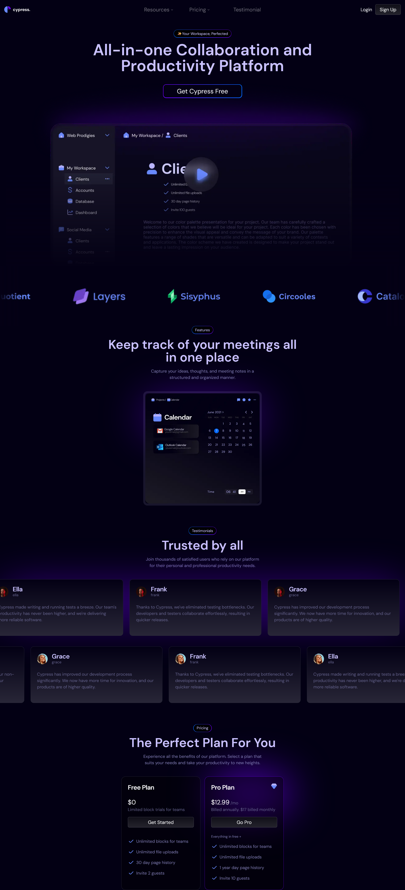
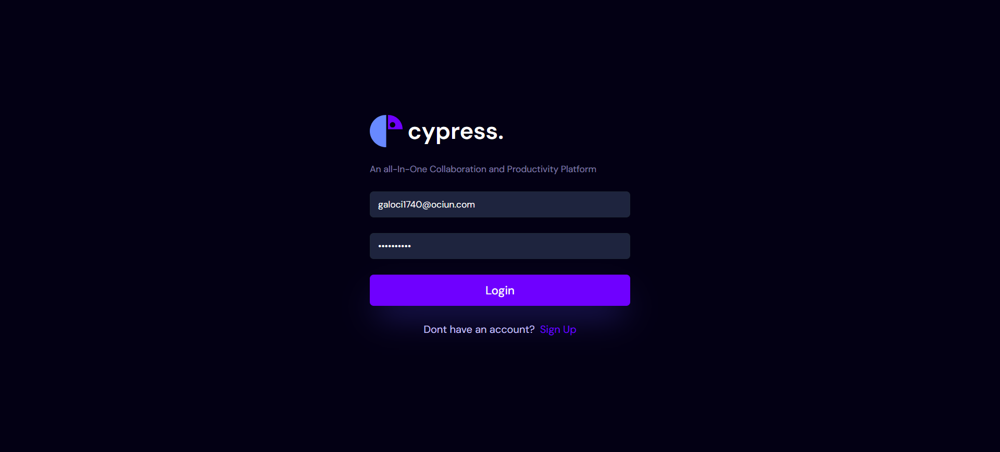
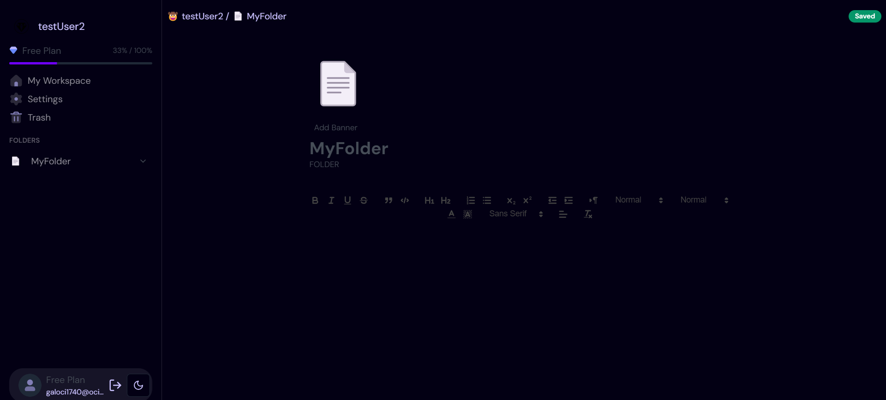
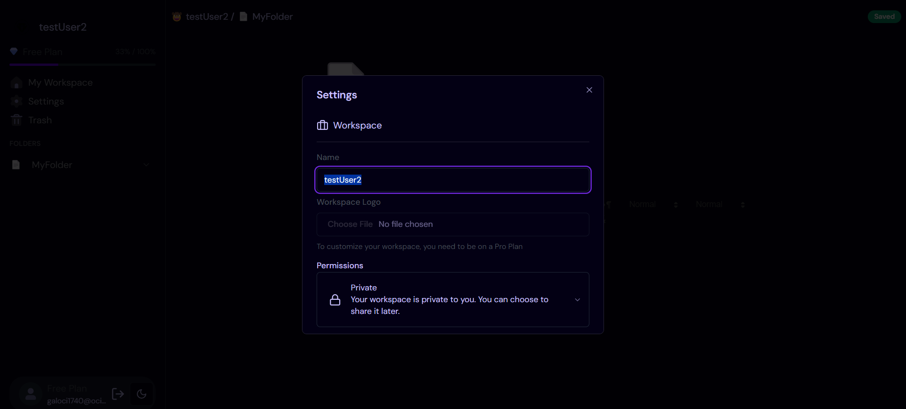
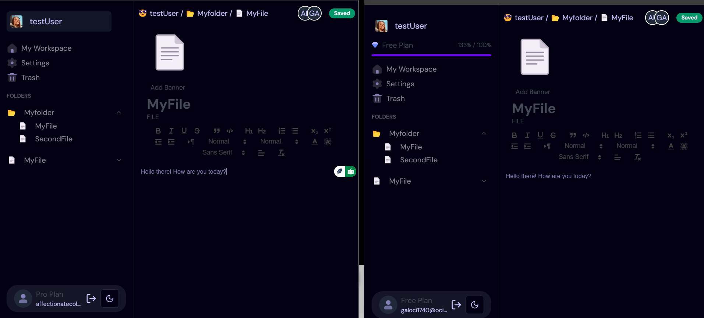
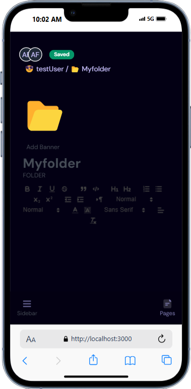

# #️⃣Portfolio Project - Notion Clone

## Table of contents

- [#️⃣Portfolio Project - Notion Clone](#️⃣portfolio-project---notion-clone)
  - [Table of contents](#table-of-contents)
  - [Overview](#overview)
  - [💾Core Features](#core-features)
    - [📸Screenshots](#screenshots)
      - [🖥️Desktop](#️desktop)
      - [📱Mobile](#mobile)
    - [🔗Links](#links)
    - [⚙️Built with](#️built-with)
    - [👨‍💻Continued development](#continued-development)
  - [Author](#author)

## Overview

A notion clone app on steriods

## 💾Core Features

- Real-time cursors
- Real-time text selection
- Real-time database and collaboration
- Real-time presence
- Move to trash functionality
- Custom emoji picker
- Light mode dark mode
- App router
- Creating free plan restrictions
- Take monthly payments
- Custom email 2FA invitation
- Supabase Row level policy
- Real-time Collaboration
- Deployment
- Custom Rich text editor
- Update profile settings
- Manage payments in a portal
- Custom Authentication
- Websockets
- Optimistic UI
- Responsive design

  
### 📸Screenshots

#### 🖥️Desktop

#### 📱Mobile

### 🔗Links

- GitHub Repo: [View Repo](https://github.com/Gandah/notion-clone.git)
- Live Site URL: [Visit Site]()

### ⚙️Built with

- Next.js
- Supabase
- Shadcn UI
- TailwindCSS
- Drizzle ORM
- Lucide react
- React Hook Form
- Socket.io
- Stripe
- UUID
- Zod
- TypeScript

### 👨‍💻Continued development
 - fix Subscription
 - fix cursors 

## Author

- LinkedIn - [MyLinkedIn](https://www.linkedin.com/in/gandahkelvin)
- Website - [Portfolio](https://gandah-porfolio.vercel.app/)
